# Reimplement :car:

Still under construction:

- [x] finish the feature preprocessor
- [x] finish the hierarchical GNN
- [x] overfit the tiny sample dataset
- [ ] refine the feature preprocessor (how to encode the features)
- [ ] Check the correctness of hierarchical-GNN's implementation
- [ ] More advanced trajectory predictor, generate diverse trajectories (MultiPath, or variational RNNs; current using MLP)
- [ ] run on the whole dataset

## Environment
Install the packages mentioned in requirements.txt
```
pip install -r requirements.txt
```

> torch==1.4.0
> argoverse-api
> numpy==1.18.1
> pandas==1.0.0
> matplotlib==3.1.1
> torch-geometric==1.5.0

## Usage

### 1) feature preprocessing (compute_feature_module.py)
```
$ python compute_feature_module.py
```
Use (200, 200) size for a single sequence as the paper told.

### 2) train the model (train.py; overfit a tiny dataset)
```
$ python train.py
```

## Result and visualization for overfitting tiny dataset

Sample results are shown below:
* red lines are agent input and ground truth output
* blue points are predicted feature tarjectory
* light blue lanes are other moving objects
* grey lines are lanes

### Using nearby context (about 5M around):
| | |
|:-------------------------:|:-------------------------:|
| 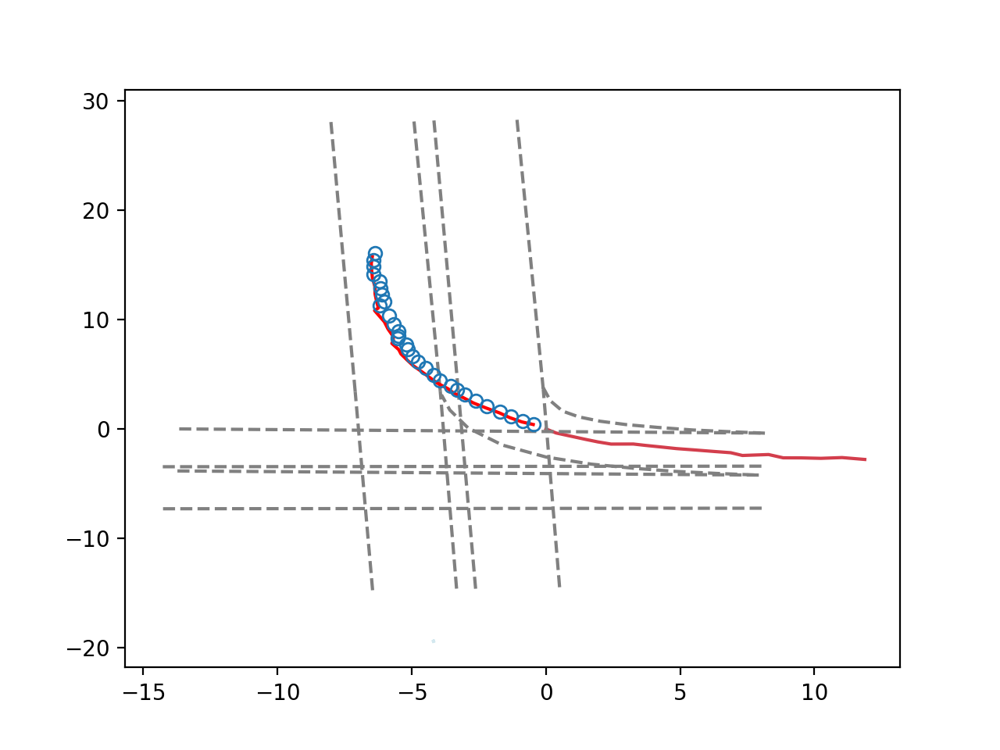 |  |
| 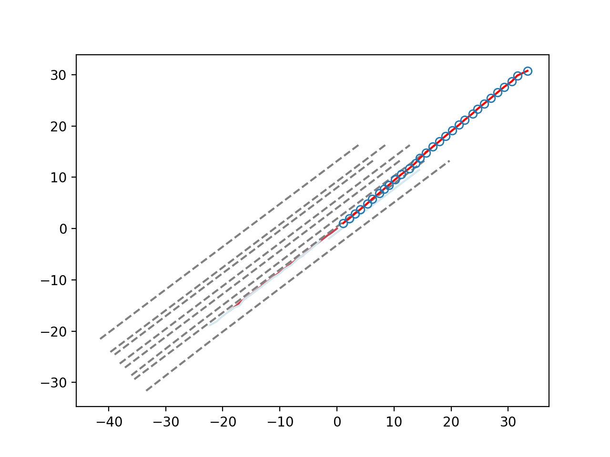 | 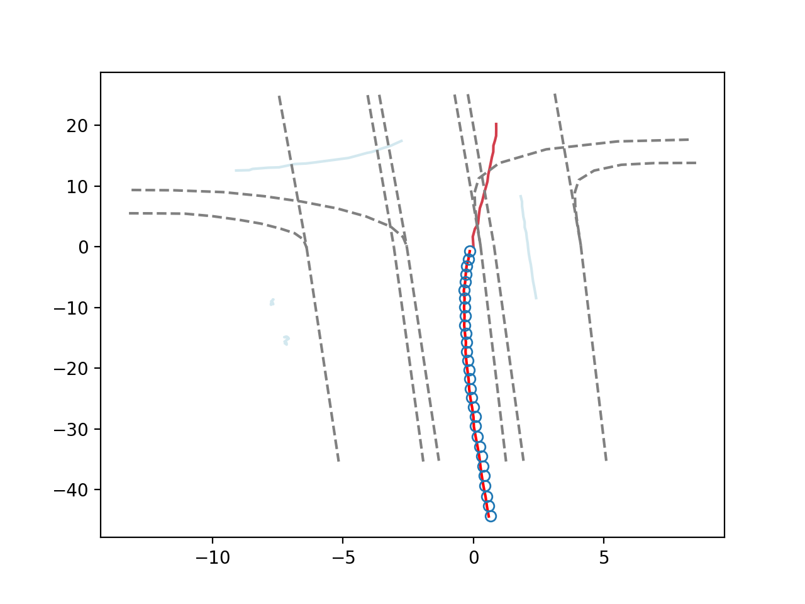 |

### Using 200 * 200 context (about 100M around):
with lanes:
| | |
|:-------------------------:|:-------------------------:|
| 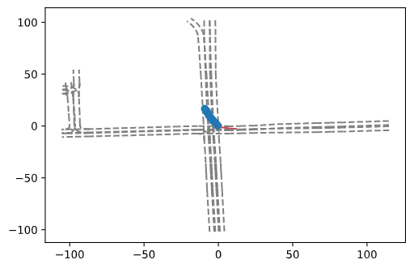 | 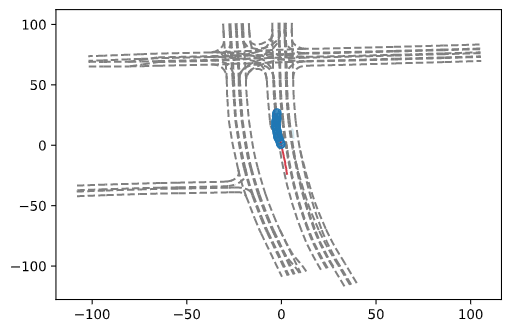 |
|  | 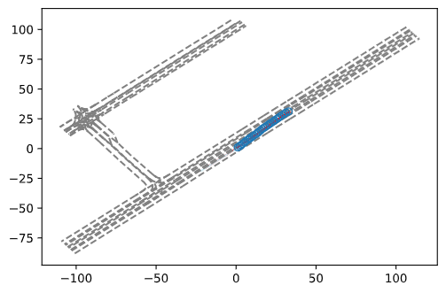 |
| 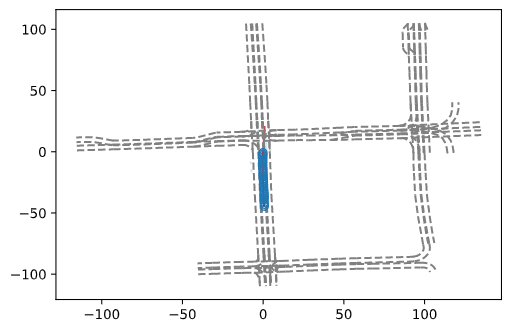 |  |

without lanes:
| | |
|:-------------------------:|:-------------------------:|
| 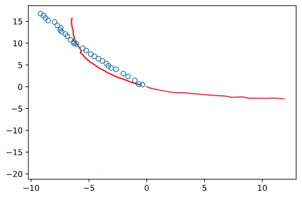 | 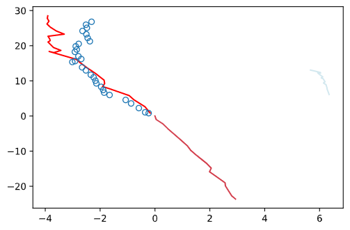 |
| 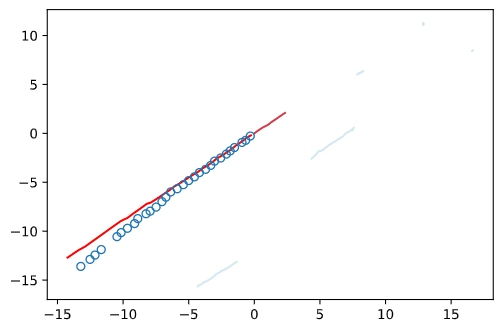 | 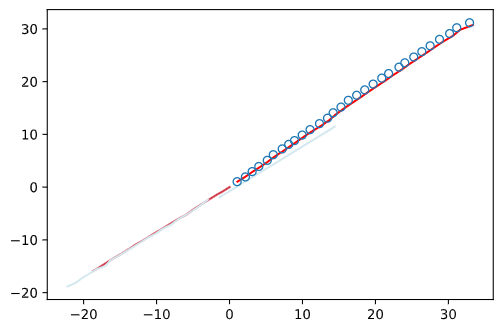 |
|  |  |
